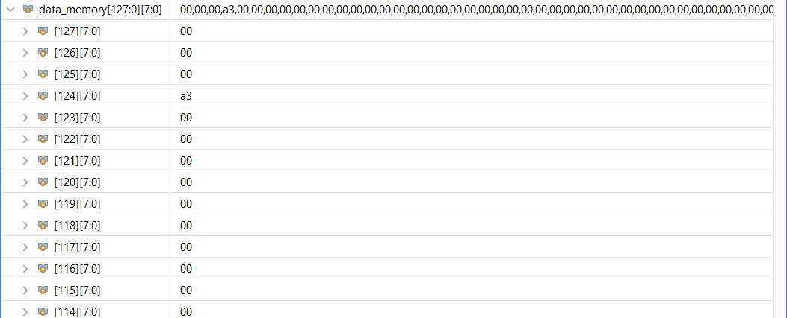
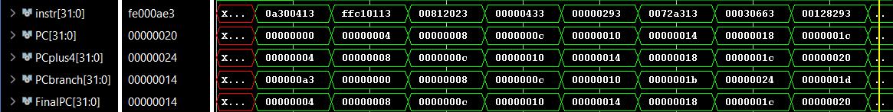
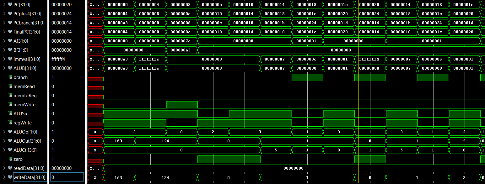

# Basic instructions

Example risc-v asm code:
```
addi s0, zero, 163
addi sp, sp, -4
sw s0, 0(sp)
add s0, zero, zero
addi t0, zero, 0
LOOP:
   slti t1, t0, 7
   beq t1, zero, SHR
   addi t0, t0, 1
   beq zero, zero, LOOP
SHR:
   jal s2, EXIT 
EXIT:
    ori t1, t1, 10
    lw s0, 0(sp)
    addi sp, sp, 4
    addi s4, s4, 2
    sub s0, s0, s4
```

This program does the following: (Sry I took this from gpt)

The code begins by storing the value 163 into the stack.
It then initializes a loop where the value in register t0 starts at 0.
The loop increments t0 until it reaches 7.
Once t0 >= 7, it exits the loop and performs some operations at the EXIT label.
The EXIT label manipulates the value of t1 by performing a bitwise OR with 10, loads back the value of s0 from the stack, and cleans up the stack.
Finally, s4 is incremented by 2, and then s0 is decremented by the new value of s4

## Final Values in data memory and registers:


Everything in data memory other than location 124 are zeroes


Registers other than ones shown in image are zeros
(We can see that t0 is indeed 7)

## Register contents during runtime:

Please check out the logs file

Reg 8 - s0  
Reg 2 - sp  
Reg 5 - t0  
Reg 6 - t1  
Reg 18 - s2  
Reg 20 - s4

## Checking PC:



We can see that Program counter increments correctly and executes the instructions
PC -> Actual value of program counter
PCPlus4 -> PC + 4
PCBranch -> PC if branch is 1
FinalPC -> Next PC (Output of MUX)

## Testing few instructions:



(Here the flag is the start of SHR Label)

- addi s0, zero, 163

Here s0 = 0 + 163 => s0 = 163

We can see that writeData is 163 and ALUOut is also 163

Similarly for addi sp, sp, -4

- sw s0, 0(sp)

This instruction stores 163 (0xa3) in the location 124 of memory
Here no ALU ops so ALUOut is 0

- add s0, zero, zero

s0 = 0 + 0 => s0 = 0

- slti t1, t0, 7

t1 = (t0 < 7) ? 1 : 0
We can see that writeData is 1 so that means t0 is less than 7 (t0 is actually 0 from prev inst)
=> t1 = 1

- beq t1, zero, SHR

Here we can see that branch line is set to one as it is a B-Type inst
But t1 is not equal to zero so branch doesn't takes place, we can also notice this from FinalPC value that it is taken from PCPlus4 not from PCBranch

- beq zero, zero, LOOP

This branch is executed and PC value is updated to start of this label as zero, zero is always true (since zero = zero)

- jal s2, EXIT

Unconditional branch to EXIT Label,
The value stored in s2 = (EXIT - PC) => s2 = 0x00000028 - 0x00000024 => s2 = 0x4

