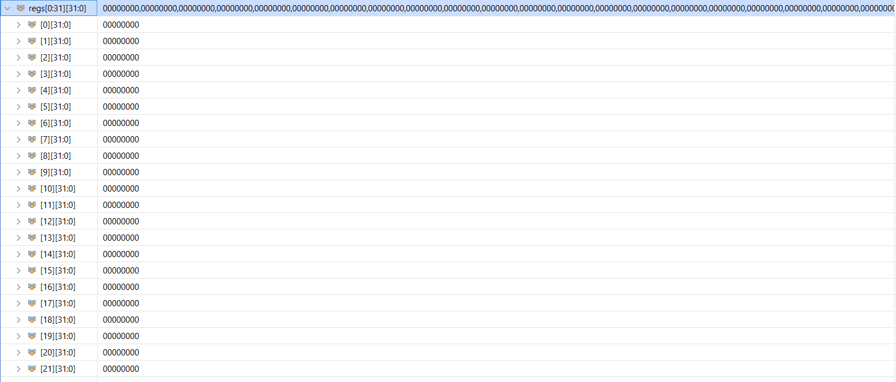

# Questions

```
a) Write down the values of all the control signals for beq, sw  and lw instructions. Use “x” for don’t care.
```

For beq =>

branch   = 1;  
memRead  = 0;  
memtoReg = 0;  
ALUOp    = 2'b01;  
memWrite = 0;  
ALUSrc   = 0;  
regWrite = 0;  
jal =0;  
auipc = 0;  
zero = 1;  

For sw =>

branch   = 0;  
memRead  = 0;  
memtoReg = 0;  
ALUOp    = 2'b00;   
memWrite = 1;  
ALUSrc   = 1;  
regWrite = 0;  
jal =0;  
auipc = 0;  
zero = x;  

For lw =>

branch   = 0;  
memRead  = 1;  
memtoReg = 1;  
ALUOp    = 2'b00;  
memWrite = 0;  
ALUSrc   = 1;  
regWrite = 1;  
jal = 0;  
auipc = 0;  
zero = x;  

```
b) Consider the following RISC-V assembly code:
loop: slt x2,x0,x1
          beq x2,x0,DONE
          addi x1,x1,-1
          addi x2,x2,2
          j loop
 done:
Assume the register x1 is initialized to the value 8. What is the final value in register x2 assuming the x2 is initially 2?
```

All regs become 0

```
c) Modify the single cycle RISC V datapath to add a custom instruction, that counts the number of trailing zeros, in register rs1

What are the new control signals required?
```

This is a R-type inst, "Some identifier" r1, rs1  
We can add a custom opcode and ALUCtl for this instruction  
No need of any new control signals  


